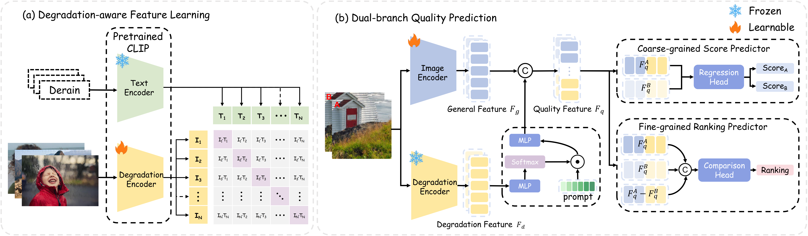

<div align="center">
    <a href="https://arxiv.org/abs/2508.14475"></a>
    <a href="https://pxf0429.github.io/FGResQ/"></a>
    <a href='https://github.com/sxfly99/FGRestore/stargazers'></a>
</div>

<h1 align="center">Fine-grained Image Quality Assessment for Perceptual Image Restoration</h1>

<div align="center">
    <a href="https://github.com/sxfly99">Xiangfei Sheng</a><sup>1*</sup>,
    <a href="https://github.com/pxf0429">Xiaofeng Pan</a><sup>1*</sup>,
    <a href="https://github.com/yzc-ippl">Zhichao Yang</a><sup>1</sup>,
    <a href="https://faculty.xidian.edu.cn/cpf/">Pengfei Chen</a><sup>1</sup>,
    <a href="https://web.xidian.edu.cn/ldli/">Leida Li</a><sup>1#</sup>
</div>

<div align="center">
  <sup>1</sup>School of Artificial Intelligence, Xidian University
</div>

<div align="center">
<sup>*</sup>Equal contribution. <sup>#</sup>Corresponding author. 
</div>

<div align="center">
  
</div>

## Quick Start

This guide will help you get started with the FGResQ inference code.

### 1. Installation

First, clone the repository and install the required dependencies.

```bash
git clone https://github.com/sxfly99/FGRestore.git
cd FGRestore
pip install -r requirements.txt
```

### 2. Download Pre-trained Weights

You can download the pre-trained model weights from the following link:
[**Download Weights (Google Drive)**](https://drive.google.com/drive/folders/10MVnAoEIDZ08Rek4qkStGDY0qLiWUahJ?usp=drive_link)

Place the downloaded files in the `weights` directory.

- `FGResQ.pth`: The main model for quality scoring and ranking.
- `Degradation.pth`: The weights for the degradation-aware task branch.

Create the `weights` directory if it doesn't exist and place the files inside.

```
FGRestore/
|-- weights/
|   |-- FGResQ.pth
|   |-- Degradation.pth
|-- model/
|   |-- FGResQ.py
|-- requirements.txt
|-- README.md
```

## Usage

The `FGResQ` provides two main functionalities: scoring a single image and comparing a pair of images.

### Initialize the Scorer

First, import and initialize the `FGResQ`.

```python
from model.FGResQ import FGResQ

# Path to the main model weights
model_path = "weights/FGResQ.pth"

# Initialize the inference engine
model = FGResQ(model_path=model_path)
```

### 1. Single Image Input Mode: Quality Scoring

You can get a quality score for a single image. The score typically ranges from 0 to 1, where a higher score indicates better quality.

```python
image_path = "path/to/your/image.jpg"
quality_score = model.predict_single(image_path)
print(f"The quality score for the image is: {quality_score:.4f}")
```

### 2. Pairwise Image Input Mode: Quality Ranking

You can also compare two images to determine which one has better quality.

```python
image_path1 = "path/to/image1.jpg"
image_path2 = "path/to/image2.jpg"

comparison_result = model.predict_pair(image_path1, image_path2)

# The result includes a human-readable comparison and raw probabilities
print(f"Comparison: {comparison_result['comparison']}")
# Example output: "Comparison: Image 1 is better"

print(f"Raw output probabilities: {comparison_result['comparison_raw']}")
# Example output: "[0.8, 0.1, 0.1]" (Probabilities for Image1 > Image2, Image2 > Image1, Image1 ≈ Image2)
```
## Citation

If you find this work is useful, pleaes cite our paper!

```bibtex

@article{sheng2025fg,
  title={Fine-grained Image Quality Assessment for Perceptual Image Restoration},
  author={Sheng, Xiangfei and Pan, Xiaofeng and Yang, Zhichao and Chen, Pengfei and Li, Leida},
  journal={arXiv preprint arXiv:2508.14475},
  year={2025}
}
